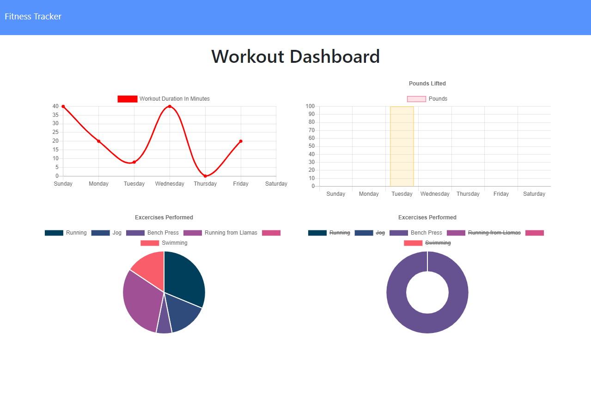

# Fitness Tracker

https://fitnesstrackerwk18.herokuapp.com/

Table Of Contents:

- [Section 1: Introduction](#introduction)
- [Section 2: Installation](#installation)
- [Section 3: Usage](#usage)
- [Section 4: License](#license)

## Introduction:

This project is a simple and clear exercise logging tool made in JavaScript, using MongoDB to store data. It gives the user the ability to create and continue workouts, add exercises to those workouts, and view their activity in a dashboard that gives visual aides to interpreting their data.

## Installation:

You can access this project through any internet capabale browser. To work on the code itself, download the files from the GitHub repository, run npm install to get all the dependencies, and make sure to spin up a MongoDB database, either locally or through a cloud service like MongoDB Atlas. You can then declare your personal connection string as URI in a .env file which should reside in your base directory.

## Usage:

You may use this code in any way you please that follows the GNU license

## License:

GNU General Public License v3.0

## Questions: 

You can contact me with questions via:
- [Email](plover.brown@gmail.com)
- [GitHub](https://www.github.com/rebgrasshopper)
- [LinkedIn](https://www.linkedin.com/in/plover-brown-37b6981a5)
